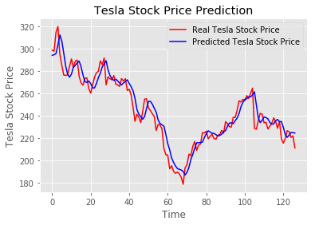

# Stock Price Prediction with SVR and LSTMs  

This is a small project where I'm experimenting with stock price prediction using Support Vector Regression (SVR) and Long Short-Term Memory (LSTM) networks. I'm just trying to get a basic understanding of how these models work for time series data.  

## What This Does  
The project looks at stock prices and tries to predict future values using two different approaches:  
1. **Support Vector Regression (SVR)** – A more traditional ML approach  
2. **LSTMs (Long Short-Term Memory networks)** – A deep learning approach  

## Example Output  
Here's an example of what the predictions look like:  

  

## Stuff Used  
To run this, you'll need:  
- Python 3.6.4  
- NumPy 1.16.4  
- TensorFlow 1.14.0  
- Keras 2.2.4  

## Files in This Repo  
- **Raw_Stock_Prediction.ipynb** – Main notebook with the model  
- **LSTM_Stock_Prediction_Explanation.ipynb** – A more detailed version with explanations on SVR, LSTMs, and how the code works  
- **Images/** – Just some visuals used in the notebooks  

## How to Use  
1. Make sure you have Jupyter Notebook installed  
2. Open a terminal and run:  
   ```bash
   jupyter notebook
   ```  
3. Open any of the notebooks and run the cells  

Still figuring things out, but it's been fun messing around with this! 🚀
